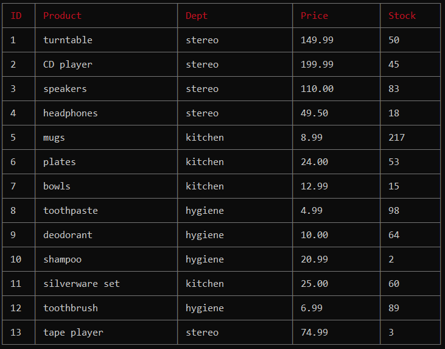
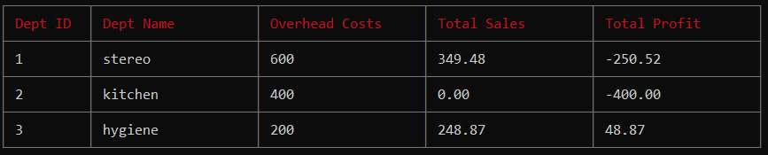

# Storefront and Inventory App
<https://github.com/JarrettD5309/inventory-store> \
Version 1.0 \
Original Deployment Date - June 27, 2020\
By Jarrett Dougherty

## Description
Storefront and Inventory App is a Node.js CLI program that mimics an Amazon-like store. Running the various JavaScript files in Node allows for three different user experiences, Customer, Manager, and Supervisor, each with its own functionality. Customers can view and buy items. Managers can check and add to inventory and create new items. Supervisors can check sales by department and create new departments. Each user experience relies on and interacts with the same database utilizing MySQL. The purpose of the app is to create a store-like environment that allows multiple types of dynamic interactions with a single server-side database.

## Technologies Used
* Javascript
* Node.JS
* MySQL
* Dotenv
* Inquirer
* Cli-table

## Instructions For Use
### Getting Started
1. Once you download the program you will need to run the following command to install the required node packages:

```console
$ npm install
```
2. Create a MySQL database and table using the `bamazon-schema.sql` commands. Create an additional table using `department-schema.sql`. These tables can be seeded with `bamazon-seed.sql` and `department-seed.sql`.

3. Next, create a file named `.env`, add the following to it, replacing the value P@ssw0rd with your MySQL password:

```console
# mySQL password

password=P@ssw0rd

```

### Customer View
1. Enter the following code to start the program.

```console
$ node bamazonCustomer.js
```

2. You will see a table displayed similar to below, as well as the following prompt.



```console
? Please choose an option: (Use arrow keys)
> Buy An Item
  EXIT
```

3. After choosing to 'Buy An Item' you will see this prompt. Enter the information requested.

```console
? What item would you like to buy? (Enter ID #)
? How many units would you like to purchase?
```

4. You will be informed of your order total similarly to what is shown below. The available inventory stock will be updated in the database. From here you can buy another item or exit Customer View.

```console
------------------
Thank you for your purchase!
Your total is $299.98.
------------------
```

### Manager View
1. Enter the following code to start the program.

```console
$ node bamazonManager.js
``` 

2. You will be given the following prompt. 'View Products for Sale' will give you the same table as the Customer View. 'View Low Inventory' will display a similar table but only the items that have less than 5 units in stock.

```console
? Please choose an option: (Use arrow keys)
> View Products for Sale
  View Low Inventory
  Add to Inventory
  Add New Product
  Exit
```

3. If 'Add to Inventory' is choosen a table of all available items will be shown along with the following prompts. After the information is entered, the inventory stock for the choosen item will be updated in the database and you will see an message similar to the one below.

```console
? Pick a product to add inventory to (Enter ID #)
? How many units do you want to add?
```
```console
------------------
The product "headphones" now has an inventory stock of 22.
------------------
```

4. If 'Add New Product' is choosen you will be given the following prompts. A table will display showing the new product information as it as been added to the database. 
```console
? What is the name of the new product you would like to add?
? What department is this product in?
? What is the price of the product? (please use only numbers ie do not enter $)(ex 19.99)
? How many units should be added to the stock?
```

5. After each action you will be given the option to return to the main menu or exit the Manager View.

### Supervisor View
1. Enter the following code to start the program.

```console
$ node bamazonSupervisor.js
``` 

2. You will see the following prompt.

```console
? Please choose an option: (Use arrow keys)
> View Product Sales by Department
  Create New Department
  EXIT
```

3. If 'View Product Sales by Department' is choosen you will see a table similar to the one below. Overhead Costs is a static number associated with each department as assigned by a supervisor. Total Sales are dynamically calculated from individual items sold in Customer View. Total Profit is the difference of these two values. Total Profit is not a stored value but is dynamically calculated and created with a MySQL SELECT statement.



4. If 'Create New Department' is choosen you will be given the following prompts. After the information is entered you will see the message below along with a table showing the newly created department as it is stored in the database.

```console
? What is the name of the new department?
? What is the overhead of the new department? (please enter a only whole number)(ex 10000)
```

5. After each action you will be able to choose another action or exit the Supervisor View.

## GIF/Video Example
### Customer View


### Manager View


### Supervisor View


full demo video - <https://drive.google.com/file/d/1vGghbQEhaS5XMJYl8egh869Dh1RAEHf9/view?usp=sharing>

